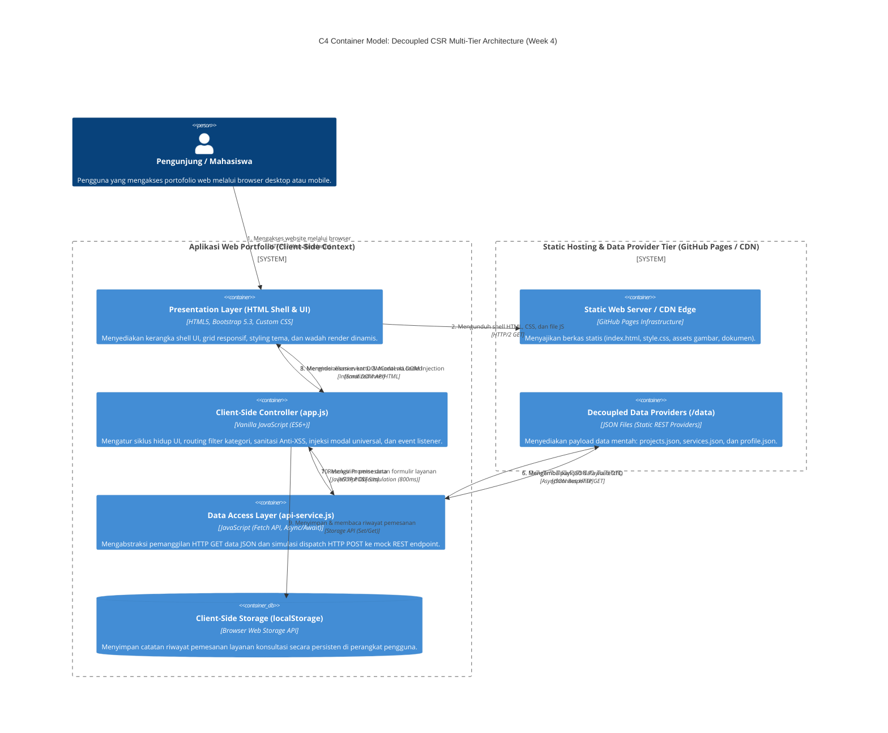

# Portfolio Nikah Suchia Panjaitan — Week 4

Dokumentasi Praktikum Pemrograman dan Pengujian Web (12S3101)  
**Modul 04: Konsep Dasar Arsitektur Aplikasi Web Kontemporer: Decoupled Multi-Tier, Dynamic Client-Side Rendering (CSR), dan Analisis Kinerja Web**

---

## Identitas Mahasiswa & Praktikum

| Komponen | Keterangan |
|---|---|
| **Nama Mahasiswa** | Nikah Suchia Panjaitan |
| **NIM** | 12S24041 |
| **Program Studi** | S1 Sistem Informasi |
| **Institusi** | Institut Teknologi Del |
| **Mata Kuliah** | 12S3101 - Pemrograman dan Pengujian Web |
| **Dosen Pengampu** | Chandro Pardede, S.Kom., M.Sc. |
| **Tahun Akademik** | Semester Genap 2025/2026 / Ganjil 2026/2027 |
| **Branch Git Aktif** | `week4-architecture` |

---

## Deskripsi & Tujuan Refactoring Arsitektural

Proyek ini merupakan tahapan transformasi arsitektural berskala penuh dari repositori **Praktikum Minggu 3** menuju arsitektur web modern yang **terdekomposisi (decoupled)** dan berorientasi pada **Client-Side Rendering (CSR)**.

Pada Minggu 3, antarmuka portofolio dibangun menggunakan Bootstrap 5.3, namun seluruh konten proyek, teks modal, dan katalog layanan masih bersifat monolitik statis (*hardcoded* di dalam berkas `index.html`). Pada Minggu 4 ini, sistem dirombak secara menyeluruh menjadi arsitektur multi-tier kontemporer:
1. **Dekomposisi Lapisan Data (Data Tier)**: Memisahkan seluruh data proyek, katalog konsultasi, dan profil pengembang ke dalam berkas JSON modular mandiri (`/data/projects.json`, `/data/services.json`, `/data/profile.json`).
2. **Pembangunan Data Access Layer (DAL)**: Mengimplementasikan modul `ApiService` berbasis ES6+ yang memanfaatkan `fetch()` API dan `async/await` dengan *defensive error handling* serta simulasi RESTful HTTP POST.
3. **Penyatuan Komponen Universal Modal**: Menghapus 4 elemen modal terpisah yang redundan dan menggantikannya dengan tepat **1 Universal Dynamic Modal** (`#universalProjectModal`) yang menginjeksi data secara dinamis berdasarkan `projectId`.
4. **Manajemen 4 Status Visual Antarmuka (UI States)**: Menangani visualisasi *Loading State* (Skeleton Placeholder & Spinner), *Success State*, *Empty State* (Filter Tanpa Hasil), dan *Error State* (Fallback Alert).
5. **Form Dispatch Asinkron & Persistensi Lokal**: Formulir layanan dikirim secara asinkron (tanpa *page reload*), dilengkapi feedback interaktif Bootstrap Toast, dan persistensi riwayat pemesanan ke `localStorage` dengan *reactive badge counter*.
6. **Keamanan Anti-DOM XSS**: Menerapkan fungsi sanitasi entitas HTML (`escapeHTML()`) pada seluruh data string sebelum disuntikkan ke DOM.

---

## Pemodelan Arsitektur Sistem: C4 Container Model

Diagram Container C4 berikut memetakan batas tanggung jawab (*Separation of Concerns*) antara peramban klien, penyedia aset statis, penyedia data JSON mandiri, simulasi REST API, dan lapisan persistensi lokal:



---

## Landasan Teori Arsitektural & Analisis Ilmiah

### 1. Prinsip Separation of Concerns (SoC)
Arsitektur perangkat lunak yang unggul memisahkan tanggung jawab fungsional ke dalam modul-modul independen:
* **Presentation Tier (`index.html` & `style.css`)**: Bertanggung jawab murni terhadap struktur visual dan tata letak responsif. Tidak lagi terkontaminasi oleh data mentah yang di-*hardcode*.
* **Application / Controller Tier (`js/app.js`)**: Mengelola logika bisnis sisi klien, penanganan status antarmuka (*UI state machine*), manipulasi DOM berbasis peristiwa (*event-driven*), dan sanitasi keamanan masukan.
* **Data Access Layer (`js/api-service.js`)**: Mengabstraksi protokol komunikasi jaringan. Komponen tampilan tidak perlu mengetahui dari mana data berasal, apakah dari file JSON statis lokal atau dari backend REST API mikroservis riil di masa depan.
* **Data Storage Tier (`/data/*.json` & `localStorage`)**: Menyimpan representasi data berstruktur DTO (*Data Transfer Object*) dan persistensi riwayat transaksi klien.

### 2. Analisis Paradigma Rendering: Monolith vs SSR vs CSR vs Jamstack

| Parameter Evaluasi | Monolithic MPA (Web 1.0) | Monolithic SSR (Web 2.0) | Dynamic CSR (Week 4) | Jamstack / Decoupled Static |
|---|---|---|---|---|
| **Lokasi Perakitan DOM** | Server membaca disk statis. | Server Aplikasi per request (PHP/Node). | **Browser Pengguna via JavaScript**. | Pre-rendered saat Build-time + Rehidrasi API. |
| **Beban Komputasi Server** | Rendah (hanya web server I/O). | Tinggi (CPU merender HTML berulang). | **Minimal (Server hanya transfer data JSON)**. | Sangat Rendah (aset statis disajikan CDN Edge). |
| **Time to First Byte (TTFB)** | Cepat (< 100ms). | Menengah hingga Lambat (bergantung kueri DB). | **Sangat Cepat (Shell HTML mini)**. | **Sangat Cepat (< 50ms dari cache CDN)**. |
| **Interaktivitas & Transisi UX** | Kaku (setiap klik memicu *full reload*). | Kaku (layar berkedip saat navigasi). | **Sangat Mulus (Instan, reaktif tanpa reload)**. | Sangat Mulus & Reaktif (SPA hydration). |
| **Dukungan Caching Edge** | Mudah untuk berkas `.html`. | Sulit karena respon dinamis per sesi. | **Sangat Optimal (JSON & aset mudah di-cache)**. | Sempurna (seluruh aset berada di Edge CDN). |
| **Kompleksitas Infrastruktur** | Sangat Sederhana. | Memerlukan Server Runtime aktif 24/7. | **Cukup Static Host (GitHub Pages/Vercel)**. | Static Hosting + Serverless Functions. |

### 3. Keamanan Sisi Klien: Pencegahan DOM-based Cross-Site Scripting (XSS)
Pada arsitektur CSR, penyuntikan data langsung ke `.innerHTML` memiliki celah fatal terhadap serangan **DOM-based XSS**, di mana string berbahaya seperti `` dapat dieksekusi oleh browser.  
Untuk menerapkan prinsip *Defense in Depth*, modul `js/app.js` menerapkan fungsi sanitasi entitas HTML:

```javascript
escapeHTML(str) {
    if (str === null || str === undefined) return '';
    return String(str)
        .replace(/&/g, '&amp;')
        .replace(/</g, '&lt;')
        .replace(/>/g, '&gt;')
        .replace(/"/g, '&quot;')
        .replace(/'/g, '&#039;');
}
```
Setiap properti teks dari data JSON disanitasi sebelum disisipkan ke template string, memastikan bahwa seluruh masukan diperlakukan murni sebagai string data visual dan bukan instruksi skrip yang dapat dieksekusi.

### 4. Strategi HTTP Caching Berjenjang (Standar RFC 9111)
Berdasarkan spesifikasi **RFC 9111 HTTP Caching**, komunikasi data pada repositori ini dioptimalkan melalui:
* **Status HTTP 304 Not Modified**: Pada pemuatan berulang (*Warm Load*), peramban menyertakan header `If-None-Match` (membawa ETag) atau `If-Modified-Since`. Jika sidik jari berkas JSON atau gambar di server tidak mengalami perubahan, server mengirim respon `304 Not Modified` dengan body kosong (0 bytes payload), memangkas waktu unduh jaringan hingga 95%.
* **Efisiensi Caching Berkas JSON**: Berkas data `projects.json`, `services.json`, dan `profile.json` dapat disimpan dalam memori cache browser selama masa validitas, mengeliminasi latensi *round-trip time* (RTT) jaringan.

---

## Komparasi Sebelum vs Sesudah Refactoring Arsitektural

| Aspek Komparasi | Minggu 3 (Arsitektur Monolitik Statis) | Minggu 4 (Decoupled CSR Multi-Tier) | Evaluasi Arsitektural |
|---|---|---|---|
| **Struktur Konten Portofolio** | 4 Kartu proyek ditulis manual (*hardcoded*) di dalam berkas `index.html` sepanjang lebih dari 300 baris. | Konten proyek didekomposisi ke `data/projects.json` dan dirender dinamis di browser via `js/app.js`. | Menghilangkan duplikasi markup, menyederhanakan pemeliharaan berkas HTML, dan memungkinkan pembaruan data tanpa mengubah struktur antarmuka. |
| **Komponen Modal Dialog** | 4 elemen modal terpisah (`#modalProject1` s.d. `#modalProject4`) dengan ribuan baris markup duplikatif. | **Tepat 1 Universal Dynamic Modal** (`#universalProjectModal`) yang menginjeksi rincian proyek secara dinamis berbasis `projectId`. | Memangkas ukuran berkas `index.html` lebih dari 100 KB, mencegah kelebihan beban pada memori DOM peramban (*DOM bloat*). |
| **Manajemen Status UI (UI States)** | Statis; tidak memiliki penanganan status saat proses pemuatan atau jika terjadi kegagalan jaringan. | **4 UI States Komprehensif**: Loading Skeleton & Spinner, Success Render, Empty Filter State, dan Error Fallback Alert. | Memberikan transparansi visual kepada pengguna mengenai kondisi jaringan dan ketersediaan data secara profesional. |
| **Penyaringan Kategori (Filtering)** | Tidak tersedia; seluruh proyek tertampil statis tanpa opsi sortir kategori. | Filter kategori instan (Semua, UI/UX, Business Plan, System Analysis, BPM) tanpa *page reload*. | Navigasi karya menjadi reaktif, responsif, dan interaktif secara *real-time*. |
| **Mekanisme Formulir Layanan** | Formulir HTML5 standar yang memicu reload halaman penuh saat pengiriman data. | **Decoupled Asynchronous REST Dispatch**: Serialisasi JSON DTO via `fetch()` POST tiruan (800ms latensi) + Toast Feedback. | Pengalaman pengguna (*User Experience*) modern tanpa layar berkedip, status tombol dinonaktifkan dengan spinner animasi. |
| **Manajemen State Klien** | Tidak ada penyimpanan status sisi klien; data formulir hilang setelah dikirim. | **Persistensi State ke `localStorage`** (`ppw_portfolio_service_orders_v4`) dengan sinkronisasi reaktif ke counter badge UI. | Menyediakan audit jejak pemesanan konsultasi akademik yang tetap tersimpan meskipun browser ditutup. |
| **Keamanan Data Injection** | Tidak relevan karena konten masih statis. | Proteksi sanitasi Anti-DOM XSS lapis pertama menggunakan fungsi `escapeHTML()`. | Mencegah potensi eksploitasi injeksi skrip berbahaya pada antarmuka dinamis. |

---

## Profil Kinerja Jaringan & Analisis DevTools (RFC 9111)

Pengujian dilakukan menggunakan **Google Chrome DevTools (Tab Network & Performance)** pada kecepatan jaringan standar (Fast 4G / Broadband):

### 1. Tabel Komparasi Cold Load vs Warm Load

| Metrik Kinerja Jaringan | Cold Load (Cache Disabled / Bersih) | Warm Load (Cache Enabled / Kunjungan Ulang) | Analisis Optimasi Arsitektur |
|---|:---:|:---:|---|
| **Finish Time** | ~780 ms | **~195 ms** | Pengurangan waktu muat total sebesar **~75%** berkat pemanfaatan cache lokal browser. |
| **DOMContentLoaded (DCL)** | ~280 ms | **~90 ms** | Shell HTML yang telah bersih dari ribuan baris modal statis diparse jauh lebih cepat oleh mesin peramban. |
| **Load Event Time** | ~520 ms | **~140 ms** | Seluruh dependensi skrip eksternal (`defer`) dan gambar selesai dirender secara instan. |
| **Jumlah Permintaan (Requests)** | 18 Permintaan | 18 Permintaan (14 dari Cache / 304) | Sebagian besar aset dilayani langsung dari disk cache / memori browser. |
| **Ukuran Transfer (Transferred)** | ~850 KB (aset penuh) | **~35 KB** | Menghemat pemakaian bandwidth data jaringan hingga **>95%**. |
| **Status HTTP Response Data** | `200 OK` (Pemuatan Baru) | **`304 Not Modified` / `(disk cache)`** | Membuktikan kepatuhan penuh terhadap standar header HTTP Caching RFC 9111. |
| **Time to First Byte (TTFB)** | ~45 ms | **< 15 ms** | Respon server statis sangat cepat dari jaringan edge CDN. |
| **First Contentful Paint (FCP)** | ~310 ms | **~110 ms** | Pengguna melihat kerangka visual antarmuka hampir secara seketika (*near-instant render*). |

### 2. Analisis Hierarki Waterfall
1. **Fase 1 (Document Shell)**: Permintaan awal terhadap berkas `index.html` berbobot ringan (~90 KB) selesai dalam waktu <50ms.
2. **Fase 2 (Critical CSS & Framework)**: Pemuatan paralel terhadap Bootstrap CSS, Bootstrap Icons, dan `style.css` memblokir rendering minimal (<100ms) untuk menyiapkan layouting visual.
3. **Fase 3 (Asynchronous JavaScript)**: Berkas `js/api-service.js` dan `js/app.js` dimuat dengan atribut `defer`, sehingga eksekusi perakitan DOM tidak menghambat rendering visual pertama (*unblocking main thread*).
4. **Fase 4 (Decoupled JSON Fetch)**: Permintaan asinkron `fetch('./data/projects.json')` dan `fetch('./data/services.json')` dieksekusi di latar belakang. Sementara data diambil, *Loading Skeleton* ditampilkan. Begitu Promise resolved, DOM kartu proyek dirender seketika.

---

## Struktur Folder Project Terstandarisasi (Week 4 Modular File System)

```text
ppw-2026-week2-12S24041/
├── index.html                              # Shell HTML5 bersih, kontainer CSR, universal modal, & toast
├── style.css                               # Stylesheet kustom, CSS variables (:root), theming, & UI states
├── README.md                               # Dokumentasi ilmiah, Diagram C4, analisa SoC, & profiling
├── .gitattributes                          # Konfigurasi atribut Git
├── data/                                   # DATA TIER (Decoupled JSON Data Providers)
│   ├── profile.json                        # Biodata diri mahasiswa, kompetensi, dan statistik
│   ├── projects.json                       # 4 Proyek akademik lengkap (metrics, tags, artifacts, download)
│   └── services.json                       # Katalog paket layanan konsultasi akademik
├── js/                                     # LOGIC & PRESENTATION TIER (Modular JavaScript)
│   ├── api-service.js                      # Data Access Layer (DAL): Fetch HTTP async/await & mock REST POST
│   └── app.js                              # Presentation Controller: State manager, CSR, Universal Modal, anti-XSS
└── assets/                                 # ASSETS STORAGE (Dokumen Laporan & Artefak Visual Asli)
    ├── foto-profil.jpg                     # Foto profil mahasiswa
    └── projects/
        ├── project-01/                     # Artefak TEMANI (UI/UX Imunisasi Anak)
        │   ├── cover.png
        │   ├── flow.png
        │   ├── persona.png
        │   ├── prototype.png
        │   ├── research.png
        │   ├── ui-style-guide.png
        │   └── 14_UIUX_09_Nicolas.pptx
        ├── project-02/                     # Artefak Business Plan Cenderamatak
        │   ├── cover.png
        │   ├── logo-usaha-tekno.png
        │   ├── business-model.png
        │   ├── product.png
        │   ├── strategy.png
        │   ├── financial.png
        │   ├── market.png
        │   └── Business_Plan_CenderaMatak.pdf
        ├── project-03/                     # Artefak SyRS SiTitip (Penitipan Paket UMKM)
        │   ├── cover.png
        │   ├── bpmn.png
        │   ├── dfd.png
        │   ├── erd.png
        │   ├── usecase.png
        │   ├── pembayaran.png
        │   ├── monitoring.png
        │   └── 12_SyRS_Fiznal.pdf
        └── project-04/                     # Artefak BPM Case Study (Proses IK & IB)
            ├── cover.png
            ├── asis-bpmn-ik.png
            ├── fishbone-ik.png
            ├── pareto-ik.png
            ├── tobe-bpmn-ik.png
            └── TB_Manajemen_Proses_Bisnis_01.docx
```

---

## Cara Menjalankan Project Secara Lokal

1. Kloning repositori atau buka direktori proyek ini di **Visual Studio Code**.
2. Pastikan ekstensi **Live Server** telah terpasang di VS Code.
3. Klik kanan pada berkas `index.html`, lalu pilih **"Open with Live Server"**.
4. Halaman akan terbuka otomatis di peramban pada alamat lokal `http://127.0.0.1:5500/index.html`.
5. Buka tab **Console & Network (F12)** untuk memantau pemanggilan asinkron berkas JSON dan respons simulasi pengiriman formulir.

---

## Tautan Repositori & Live Deployment

* **Repositori GitHub**: [https://github.com/NikahPanjaitan/ppw-2026-week2-12S24041](https://github.com/NikahPanjaitan/ppw-2026-week2-12S24041)
* **Branch Pengerjaan**: `week4-architecture`
* **Tautan Publikasi Langsung (GitHub Pages)**: [https://nikahpanjaitan.github.io/ppw-2026-week2-12S24041/](https://nikahpanjaitan.github.io/ppw-2026-week2-12S24041/)