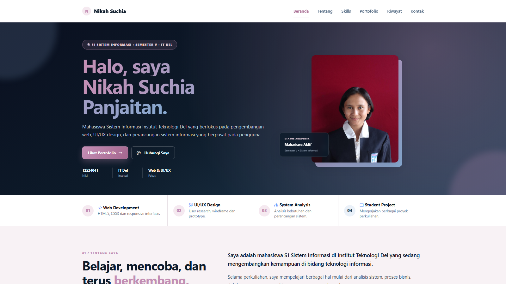
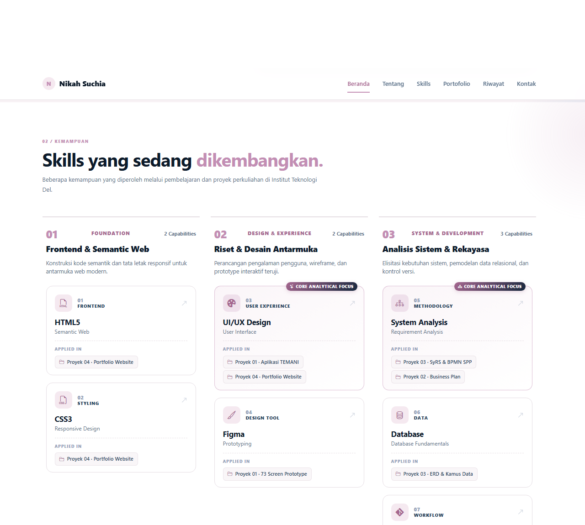
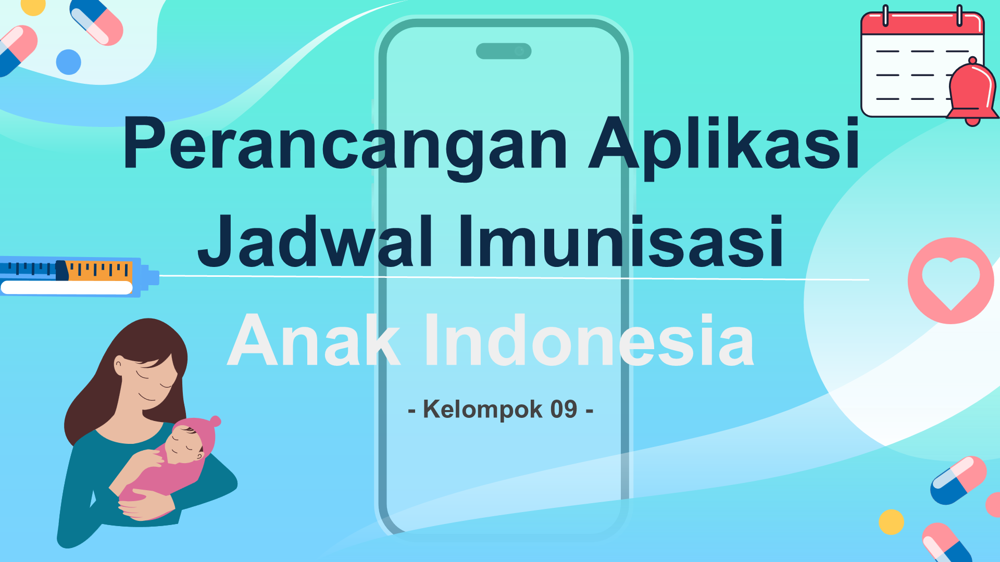
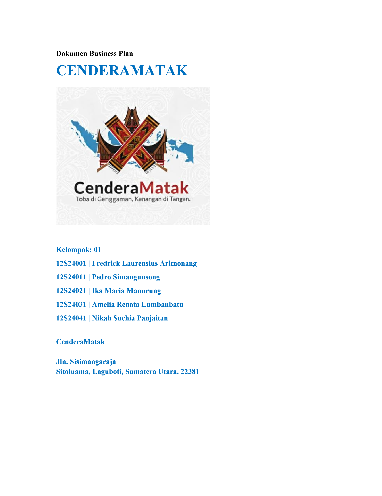
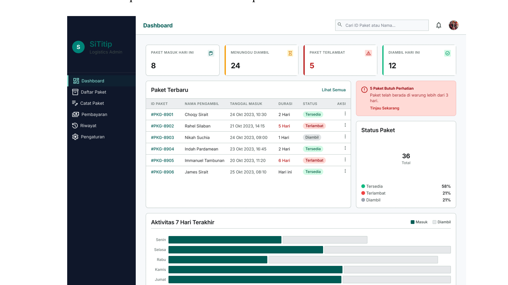
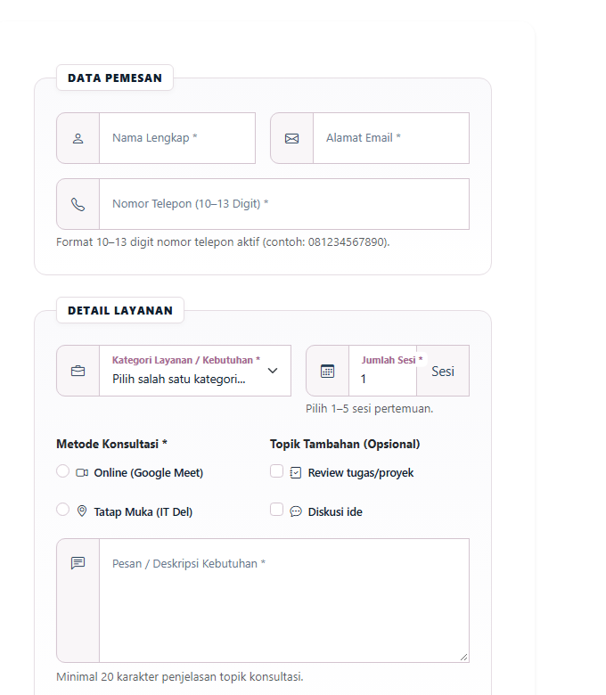
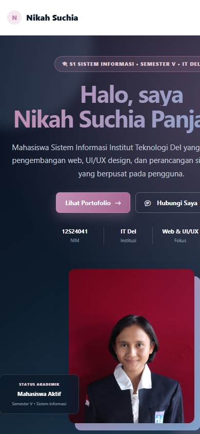

# Portfolio Nikah Suchia Panjaitan — Week 3

Dokumentasi Praktikum Pemrograman dan Pengujian Web (12S3101)  
**Modul 03: Penguasaan CSS Lanjutan, CSS Selector Spesifisitas, dan Integrasi Bootstrap 5**

---

## Identitas Mahasiswa & Praktikum

| Komponen | Keterangan |
|---|---|
| **Nama Mahasiswa** | Nikah Suchia Panjaitan |
| **NIM** | 12S24041 |
| **Program Studi** | S1 Sistem Informasi |
| **Institusi** | Institut Teknologi Del |
| **Mata Kuliah** | 12S3101 - Pemrograman dan Pengujian Web |
| **Dosen Pengampu** | Chandro Pardede, S.Kom., M.Sc. |
| **Tahun Akademik** | Semester Ganjil 2026/2027 |
| **Branch Git Aktif** | `week3-bootstrap` |

---

## Deskripsi & Tujuan Proyek

Proyek ini merupakan implementasi tugas mandiri Minggu 3 yang melanjutkan (*continuity*) dan merefaktor (*refactoring*) proyek **Personal Portfolio Website & Service Portal Minggu 2**. 

Fokus utama adalah modernisasi antarmuka web melalui integrasi framework **Bootstrap 5.3.3** dan **Bootstrap Icons 1.11.3** yang dipadukan secara harmonis dengan arsitektur **Advanced Custom CSS Overrides**, CSS Custom Properties (`:root`), pemanfaatan sistem grid 12-kolom responsif, interaktivitas modal dialog, modernisasi kontrol formulir, serta penjaminan kualitas kode bebas dari konflik spesifisitas (*Zero `!important`*).

---

## Sebelum vs Sesudah Integrasi Framework

Tabel berikut menyajikan komparasi arsitektur frontend web engineering antara implementasi baseline **Minggu 2 (HTML5 & CSS Murni)** dengan **Minggu 3 (Bootstrap 5.3 + Custom Overrides)**:

| Aspek Komparasi | Minggu 2 (Sebelum / Manual) | Minggu 3 (Sesudah / Framework Integration) | Evaluasi Arsitektur Web |
|---|---|---|---|
| **Grid & Tata Letak** | CSS Grid & Flexbox manual per section; penanganan breakpoint dilakukan manual melalui media queries terpisah. | **Bootstrap 5.3 Responsive Grid System** (`.container`, `.row`, `.col`, `.row-cols-*`, `.g-4`) dengan sistem 12-kolom terstandar. | Mengeliminasi inkonsistensi gutter antar section dan meniadakan *horizontal overflow* di layar mobile. |
| **Navbar & Navigasi** | Header sticky CSS kustom sederhana; menu horizontal statis tanpa kemampuan melipat (*collapse*) pada layar ponsel. | **Bootstrap Navbar** dengan utility `.sticky-top`, translusensi backdrop-blur, dan tombol hamburger toggle responsif (`.navbar-toggler`). | Menu adaptif melipat rapi pada viewport `< 992px` tanpa error JavaScript console. |
| **Kartu Proyek & Modal** | Kartu portofolio CSS statis sederhana; ringkasan terbatas tanpa mekanisme dialog pop-up detail studi kasus. | **Bootstrap Cards** (`.card`, `.card-body`, `.h-100`) terintegrasi dengan **4 Bootstrap Modals** (`.modal`, `.modal-dialog-scrollable`). | Informasi beranda tetap ringkas, sementara artefak teknis mendalam disajikan via modal dialog interaktif. |
| **Formulir Layanan** | Kontrol input HTML tradisional dengan styling border dasar dan penataan formulir vertikal sederhana. | **Modern Bootstrap Form**: Floating Labels (`.form-floating`), Input Groups berikon (`bi-*`), Select dropdown, dan Checkbox terms. | Pengalaman input modern, keterbacaan label optimal di layar kecil, serta validasi native HTML5 yang terstruktur. |
| **CSS Variables & Theming** | Variabel CSS independen terbatas; penataan tema rentan tertimpa saat framework diintegrasikan. | **Harmonisasi CSS Custom Properties** (`--primary`, `--accent`, `--surface`, dll.) dengan variabel bawaan Bootstrap tanpa saling merusak. | Seluruh kustomisasi tema visual personal tercapai dengan kepatuhan penuh **0 penggunaan `!important`**. |

---

## Checklist Pemenuhan Teknis Modul (Requirements Checklist)

Sesuai dengan spesifikasi Bagian V (5.2) dan rubrik analitik pada dokumen modul praktikum:

- [x] **Fondasi Framework & Semantik (15%)**:
  - Integrasi resmi Bootstrap 5.3.3 CSS & JS Bundle via CDN JsDelivr.
  - Integrasi paket ikon Bootstrap Icons 1.11.3.
  - Struktur HTML5 semantik utuh: `<header>`, `<nav>`, `<main>`, `<section>`, `<article>`, `<aside>`, `<footer>`, `<form>`, `<fieldset>`, `<legend>`, dan `<table>`.
  - Berkas kustom `style.css` dimuat setelah stylesheet Bootstrap untuk menjamin alur cascading yang benar.
- [x] **Responsive Navbar & Hero Section (20%)**:
  - Navbar dilengkapi utility `.sticky-top` dengan identitas brand yang tegas.
  - Tombol hamburger collapse berfungsi mulus membuka/menutup menu di layar ponsel tanpa error console.
  - Hero Section proporsional berbasis grid dua kolom dengan tombol *Call-to-Action* (CTA) ganda.
- [x] **Grid Portofolio & Modal Dialog (20%)**:
  - 4 buah kartu proyek (`.card`) tertata rapi dalam grid responsif (`row-cols-1 row-cols-md-2 row-cols-lg-3 g-4`).
  - Setiap kartu memuat thumbnail cover orisinal, nomor proyek, kategori, deskripsi solutif, badges teknologi, dan tombol aksi.
  - Terhubung ke 4 Bootstrap Modals (`.modal`) interaktif untuk menampilkan artefak perancangan lengkap.
- [x] **Modernisasi Formulir Layanan (15%)**:
  - Implementasi Floating Labels (`.form-floating`) pada Nama, Email, Telepon, Subjek, dan Pesan.
  - Input Groups berikon Bootstrap Icons (`bi-person`, `bi-envelope`, `bi-telephone`, `bi-chat-left-text`).
  - Kategori layanan dropdown (`.form-select`) dan checkbox persetujuan syarat ketentuan (`.form-check`).
  - Validasi formulir murni berbasis atribut standar HTML5 (`required`, `type`, `pattern`, `minlength`, `maxlength`).
- [x] **Custom Overrides & Theming (15%)**:
  - Deklarasi lebih dari 15 variabel CSS pada `:root` (melebihi batas minimal 6 variabel).
  - Skema warna personal profesional (Navy, Slate, Soft Purple Accent).
  - Mikro-interaksi transisi hover halus pada kartu proyek, tombol, dan tautan navigasi.
  - **Zero `!important`**: 100% bebas dari penggunaan aturan `!important`.
- [x] **Git Management & Deployment (15%)**:
  - Manajemen percabangan rapi pada branch `week3-bootstrap`.
  - Struktur berkas fisik proyek bersih dan terorganisir di dalam folder aset masing-masing.
  - Dokumentasi README.md terstruktur memuat komparasi teknis, screenshot, dan tautan live deployment.

---

## Ringkasan 4 Portfolio Projects

1. **Project 01 — Perancangan Aplikasi Jadwal Imunisasi Anak Indonesia**
   - *Kategori*: UI/UX Design & Mobile Prototype
   - *Fokus Engineering*: Perancangan prototipe interaktif mobile di Figma, pemodelan alur pengingat imunisasi, pelacakan riwayat vaksin, serta penyusunan UI Style Guide.
2. **Project 02 — Business Plan CENDERAMATAK**
   - *Kategori*: Business Planning & Digital Venture
   - *Fokus Engineering*: Perencanaan model bisnis suvenir kacamata khas Danau Toba, analisis kelayakan finansial, Business Model Canvas (BMC), dan perancangan varian produk.
3. **Project 03 — Sistem Informasi Pengelolaan Keuangan & Monitoring SPP**
   - *Kategori*: System Analysis & Software Requirements (SyRS IEEE 830)
   - *Fokus Engineering*: Rekayasa kebutuhan perangkat lunak, pemodelan proses bisnis BPMN 2.0, Data Flow Diagram (DFD) bertingkat, skema basis data ERD, dan spesifikasi use case.
4. **Project 04 — Pengembangan Personal Portfolio Website Responsif**
   - *Kategori*: Frontend Web Development
   - *Fokus Engineering*: Refactoring website personal portofolio multi-perangkat berbasis HTML5 semantik, arsitektur Bootstrap 5.3.3 Grid & Cards, dan custom CSS theming.

---

## Pratinjau Visual Antarmuka

| Komponen Antarmuka | Pratinjau Visual |
|---|---|
| **Hero Section & Sticky Navbar** |  |
| **Capability & Skills Showcase** |  |
| **Project 01 (UI/UX Imunisasi)** |  |
| **Project 02 (Cenderamatak)** |  |
| **Project 03 (SyRS Sistem SPP)** |  |
| **Formulir Kontak Modern** |  |
| **Responsivitas Mobile (390×844)** |  |

---

## Struktur Folder Project (Clean File System)

Struktur file fisik proyek telah ditata rapi sehingga seluruh aset dokumen dan gambar tersimpan di subdirektori masing-masing:

```text
ppw-2026-week2-12S24041/
├── index.html                              # Dokumen utama website (Bootstrap 5.3 + Semantik HTML5)
├── style.css                               # Stylesheet kustom personal & design system (Zero !important)
├── README.md                               # Dokumentasi resmi praktikum Minggu 3
├── .gitattributes                          # Konfigurasi atribut Git
└── assets/
    ├── foto-profil.jpg                     # Foto profil mahasiswa
    └── projects/
        ├── project-01/                     # Aset Project 01 (UI/UX Imunisasi Anak)
        │   ├── cover.png
        │   ├── flow.png
        │   ├── persona.png
        │   ├── prototype.png
        │   ├── research.png
        │   ├── ui-style-guide.png
        │   └── 14_UIUX_09_Nicolas.pptx
        ├── project-02/                     # Aset Project 02 (Business Plan Cenderamatak)
        │   ├── cover.png
        │   ├── logo-usaha-tekno.png
        │   ├── business-model.png
        │   ├── product.png
        │   ├── strategy.png
        │   ├── financial.png
        │   ├── market.png
        │   ├── Business_Plan_CenderaMatak.pdf
        │   └── W09S01_Business_Plan_01_CenderaMatak.docx
        ├── project-03/                     # Aset Project 03 (SyRS Sistem SPP)
        │   ├── cover.png
        │   ├── title-cover.png
        │   ├── bpmn.png
        │   ├── dfd.png
        │   ├── erd.png
        │   ├── usecase.png
        │   ├── pembayaran.png
        │   ├── monitoring.png
        │   └── 12_SyRS_Fiznal.pdf
        └── project-04/                     # Aset Project 04 (Website Portfolio)
            ├── cover.png
            ├── skills-preview.png
            ├── form-preview.png
            └── mobile-preview.png
```

---

## Cara Menjalankan Project Secara Lokal

1. Buka repositori proyek ini di **Visual Studio Code**.
2. Pastikan ekstensi **Live Server** telah terpasang.
3. Buka file `index.html`, klik kanan dan pilih **"Open with Live Server"**.
4. Halaman akan terbuka otomatis pada browser di alamat `http://127.0.0.1:5500/index.html`.

---

## Tautan Repositori & Live Deployment

- **Repositori GitHub**: [https://github.com/NikahPanjaitan/ppw-2026-week2-12S24041](https://github.com/NikahPanjaitan/ppw-2026-week2-12S24041)
- **Tautan Deployment (GitHub Pages)**: [https://nikahpanjaitan.github.io/ppw-2026-week2-12S24041/](https://nikahpanjaitan.github.io/ppw-2026-week2-12S24041/)  
  *Status Publikasi*: GitHub Pages aktif menyajikan versi hasil refactoring pada branch `week3-bootstrap` secara langsung tanpa eror 404.